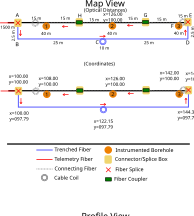
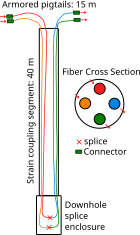

This end-to-end [inventory](../tutorial/inventory.qmd) example models an underground tunnel deployment from survey files through enriched patches. A 1500 m telemetry cable feeds trenched fiber, a buried coil, and three instrumented boreholes.

{#fig-tunnel}

Hardware uses YAML files; tabular tracks use CSV. All example files are bundled with DASCore.

```{python}
import io
import tempfile
from pathlib import Path

import numpy as np
import pandas as pd

import dascore as dc
from dascore.examples import tunnel_inventory_files, write_tunnel_inventory

files = tunnel_inventory_files(repaired=False)
root = Path(tempfile.mkdtemp()) / "tunnel_inventory"
write_tunnel_inventory(root, repaired=False)


def show(name):
    """Print one of the inventory's files."""
    print(files[name])


def table(name):
    """Read one of the inventory's CSV files back as a frame."""
    return pd.read_csv(io.StringIO(files[name]))


PATH = "fiber_arrays/XT.TUN1/path.00"
```

# What the drawing says

Reading @fig-tunnel along the fiber, from the interrogator:

| From | To | What the light passes through | Optical |
|---|---|---|---:|
| instrument room | A | telemetry cable | 1500 m |
| A | B | drop into the trench | 2.5 m |
| B | C | trenched sensing fiber | 25 m |
| C | | the buried coil | 10 m |
| C | D | trenched sensing fiber | 25 m |
| D | E | rise out of the trench | 2.5 m |
| E | 3, 2, 1 | six links between splice boxes, couplers, and borehole heads | 15 m each |
| | | three boreholes, down and back | 40 m each |

: The path, waypoint by waypoint. {#tbl-path}

A 20 m borehole holds 40 m of sensing fiber because the cable returns to the surface.

{#fig-borehole width="30%"}

The trenched cable is wound helically, so ground distance $d_r$ is shorter than optical distance $d_o$:

$$
d_r \approx d_o \cos \phi \approx 0.886\, d_o
$$

Thus 25 m of fiber covers 22.15 m of tunnel. The geometry track stores this mapping so consumers use coordinates directly.

# The hardware

Cables, enclosures, and interrogators live under `resources/`; filenames become referenced `resource_id` values.

```{python}
#| code-fold: true
#| code-summary: "resources/*.yaml — the hardware, from the purchase orders"
for name in sorted(x for x in files if x.startswith("resources/")):
    print(f"# {name}")
    print(files[name])
```

The inventory envelope defines a local `x`, `y`, `z` survey grid in meters, with `z` positive upward.

```{python}
show("inventory.yaml")
show("fiber_arrays/XT.TUN1/attrs.yaml")
```

# The path, as a table

Optical components tile the path with `distance_min` and `distance_max`. Point components such as splices state one distance. Location code `00` names the `path.00` directory.

```{python}
#| code-fold: true
#| code-summary: "path.00/optical_components.csv"
components_csv = files[f"{PATH}/optical_components.csv"]

table(f"{PATH}/optical_components.csv").head(9)
```

`object_type` selects the row model, distances determine order, and `container` values reference resources. Other tracks use the same optical distances:

```{python}
def spans(csv_text):
    """Map each component's name to the optical interval it covers."""
    frame = pd.read_csv(io.StringIO(csv_text))
    # A point component states one distance; the other end is the same one.
    ends = frame["distance_max"].fillna(frame["distance_min"])
    return dict(zip(frame["name"], zip(frame["distance_min"], ends)))


at = spans(components_csv)

print("borehole 3 sensing fiber:", at["borehole 3 down"][0], "to", at["borehole 3 up"][1])
```

# Where the fiber is

Geometry pairs surveyed control points with the fiber segments between them.

```{python}
#| code-fold: true
#| code-summary: "path.00/geometry.csv — the survey points, paired with the fiber between them"
geometry = table(f"{PATH}/geometry.csv")

geometry.head(8)
```

Unsurveyed slack links and the coil remain `nan` rather than receiving invented positions. Control-point interpolation captures the helical mapping without storing a wind angle.

# How it is attached to the ground

Coupling is interval metadata: `coupling_type` is controlled, while `medium` and `attachment` add detail.

```{python}
#| code-fold: true
#| code-summary: "path.00/coupling.csv"
coupling = table(f"{PATH}/coupling.csv")

coupling
```

The coil is `coiled`, not `trench`, because it does not sample a unique position.

# Everything else

Labels become selectable patch coordinates. Here `section` identifies installation type and `borehole` numbers the holes.

```{python}
#| code-fold: true
#| code-summary: "path.00/labels.csv"
labels = table(f"{PATH}/labels.csv")

labels
```

Each label group must use one value type.

# How the instrument was set up

An acquisition describes an instrument configuration on the path. Its filename yields acquisition key `XT.TUN1.00.DAS`; `distance_map` maps instrument distance to optical distance and remains explicit even when it is the identity.

```{python}
show("acquisitions/XT.TUN1.00.DAS.yaml")
```

# Reading it back

Loading validates schemas, resource references, and track bounds.

```{python}
inventory = dc.inventory(root)

path = inventory.networks[0].fiber_arrays[0].optical_paths[0]
print(f"{path.optical_length:.1f} m of fiber in {len(path.optical_components)} components")

names = inventory.get_names()
print("coords:", [x for x in names.coords if "." not in x])
```

# Seeing it

Plot tracks against optical distance:

```{python}
inventory.viz.path(distance=(1495, 1780), show=True);
```

Or plot the local survey grid:

```{python}
inventory.viz.map(x="x", y="z", color="section", show=True);
```

# What the data gets out of it

A patch joins the inventory by acquisition key and time.

```{python}
patch = dc.get_example_patch(
    "random_das",
    acquisition_key="XT.TUN1.00.DAS",
    time_min="2024-06-01",
    shape=(1776, 200),
)
spool = dc.spool(patch).attach_inventory(inventory)
```

Attaching reads no data; it makes inventory coordinates selectable:

```{python}
boreholes = spool.select(section="borehole")

print(f"{len(boreholes)} runs of borehole fiber")
for sub in boreholes:
    distance = sub.get_coord("distance")
    print(f"  {distance.min()} to {distance.max()} m, {sub.shape[0]} channels")
```

The three disjoint borehole runs return three patches.

[`Spool.enrich`](`dascore.core.spool.Spool.enrich`) is what puts the metadata on a patch:

```{python}
enriched = spool.enrich()[0]

print("gauge length:", enriched.attrs.gauge_length)
print("coordinates:", sorted(enriched.coords.coord_map))
```

Enrichment places surveyed channels and leaves unsurveyed ones unknown:

```{python}
depth = enriched.get_coord("z").values
along = enriched.get_coord("x").values

assert depth[1590] == -10.0
assert np.isclose(along[1510], 100.0 + 7.5 * 0.886)
assert np.isnan(depth[1000])
```

# A repair, and what it does to the data

In September, two splices and a two-meter patch cord repair a break 15 m into the trench. A new dated path epoch preserves the earlier geometry; its component table replaces one row with five and shifts downstream optical distances by two meters.

```{python}
EPOCH = "fiber_arrays/XT.TUN1/path.00@2024-09-01"

files = tunnel_inventory_files(repaired=True)
write_tunnel_inventory(root, repaired=True)

repaired_components = table(f"{EPOCH}/optical_components.csv")
repaired_csv = files[f"{EPOCH}/optical_components.csv"]

index = int(repaired_components.index[repaired_components["name"] == "trench B to the break"][0])
repaired_components.iloc[index - 1 : index + 5]
```

Generate all affected tracks from the repair description rather than editing distances independently.

```{python}
#| code-fold: true
#| code-summary: "path.00@2024-09-01 — the same tracks, against the new distances"
repaired_at = spans(repaired_csv)

repaired_geometry = table(f"{EPOCH}/geometry.csv")
print(repaired_geometry.head(6).to_string(index=False))

repaired = dc.inventory(root)
for epoch in repaired.networks[0].fiber_arrays[0].optical_paths:
    began = "the beginning" if np.isnat(epoch.time_min) else str(epoch.time_min)[:10]
    print(f"from {began}: {epoch.optical_length:.1f} m")
```

Plot the epochs:

```{python}
repaired.viz.timeline(show=True);
```

A patch spanning the epoch boundary matches both paths. [`Spool.conform_to_inventory`](`dascore.core.spool.Spool.conform_to_inventory`) splits it so each result has one valid description:

```{python}
straddling = dc.get_example_patch(
    "random_das",
    acquisition_key="XT.TUN1.00.DAS",
    time_min="2024-08-31T23:59:59",
    shape=(1776, 500),
)
crossed = dc.spool(straddling).attach_inventory(repaired)

print("patches before:", len(crossed))
conformed = crossed.conform_to_inventory()
print("patches after: ", len(conformed))
print(conformed.get_contents()[["time_min", "time_max"]].to_string(index=False))
```

Each piece enriches with the geometry valid at its recording time:

```{python}
before, after = conformed.enrich()

assert before.get_coord("z").values[1590] == -10.0
assert after.get_coord("z").values[1590] == -8.0

assert np.isclose(
    before.get_coord("x").values[1510], after.get_coord("x").values[1510]
)
```

# Shipping it

Author with the directory form; ship a single YAML file beside an archive with [`Inventory.io.to_yaml`](`dascore.core.inventory.inventory_to_yaml`). [`dc.inventory`](`dascore.core.inventory_loader.inventory`) reads either.

```{python}
text = repaired.io.to_yaml()

print(f"{len(text.splitlines())} lines of yaml")
assert dc.inventory(text) == repaired
```

Spools auto-discover `.inventory/`, `.inventory.yaml`, `.inventory.yml`, or JSON from `model_dump_json` as `.inventory.json`.

# Modeling rules

- Model one continuous run with a shared break history as one fiber array and path.
- Components are on the optical path; resources are owned objects, such as housings, that components reference.
- Represent winding and other layout details in geometry rather than custom arithmetic.
- Add a new epoch for a repair instead of editing history.
