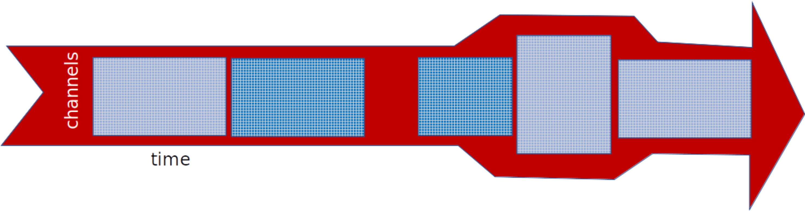

# Data structures

Most DASCore work uses two objects: a [Patch](patch.qmd), which holds one n-dimensional array with coordinates and metadata, and a [Spool](spool.qmd), which manages patches in memory, on disk, or remotely.

Patch operations are eager once a patch is loaded. Spool operations generally build lazy selections and chunking plans, loading patch arrays only when indexed, iterated, or mapped.

{#fig-patch_n_spool}

# Time

DASCore represents absolute and relative time with NumPy [`datetime64`](https://numpy.org/doc/stable/reference/arrays.scalars.html#numpy.datetime64) and [`timedelta64`](https://numpy.org/doc/stable/reference/arrays.scalars.html#numpy.timedelta64).

```{python}
import numpy as np

start = np.datetime64("2022-01-01T15:12:11")
end = start + np.timedelta64(60, "s")
minutes = (end - start) / np.timedelta64(1, "m")
```

[`dc.to_datetime64`](`dascore.utils.time.to_datetime64`) and [`dc.to_timedelta64`](`dascore.utils.time.to_timedelta64`) normalize common inputs:

```{python}
import dascore as dc

time = dc.to_datetime64("2022-01-01T12:12:12.1212")
duration = dc.to_timedelta64(1.5)
```

Numeric values passed to `to_datetime64` are Unix timestamps in seconds. Numeric values passed to `to_timedelta64` are durations in seconds.

# Dimension arguments

Most processing methods name a dimension as a keyword:

```{python}
patch = dc.get_example_patch()
temporal = patch.pass_filter(time=(1, 5))
spatial = patch.pass_filter(distance=(0.1, 0.2))
```

The function determines what the values mean. For `pass_filter`, bare numbers are inverse coordinate units: frequency for time and wavenumber for distance. Datetime coordinates always use seconds; numeric coordinates use their declared units.

For a distance coordinate in metres, `distance=(0.1, 0.2)` means wavenumbers from 0.1 to 0.2 per metre, corresponding to wavelengths from 5 to 10 metres. If the coordinate is converted to feet, the same bare numbers instead mean inverse feet.

Attach quantities to make the intended band independent of coordinate units:

```{python}
from dascore.units import m

by_wavenumber = patch.pass_filter(distance=(0.01, 0.1))
by_wavelength = patch.pass_filter(distance=(10 * m, 100 * m))
assert np.allclose(by_wavenumber.data, by_wavelength.data)
```

```{python}
in_feet = patch.convert_units(distance="ft")
assert np.allclose(
    in_feet.pass_filter(distance=(10 * m, 100 * m)).data,
    by_wavelength.data,
)
```

# Units

DASCore uses [Pint](https://pint.readthedocs.io/) quantities. Import common units or parse them with [`get_quantity`](`dascore.units.get_quantity`):

```{python}
from dascore.units import ft, get_quantity, m

distance = 10 * m
print(distance.to(ft))
assert get_quantity("meters") == 1 * m
```

Patch selection, processing, and conversion methods accept quantities directly. See [Patch units](patch.qmd#units) for examples.

Use explicit quantities whenever code may encounter the same coordinate expressed in different units. Bare values are most appropriate when the coordinate convention is fixed and documented.

Unit-aware operations preserve physical meaning through coordinate conversion and patch arithmetic. [`Patch.set_units`](`dascore.Patch.set_units`) changes labels only; [`Patch.convert_units`](`dascore.Patch.convert_units`) changes values to preserve the same quantity.
