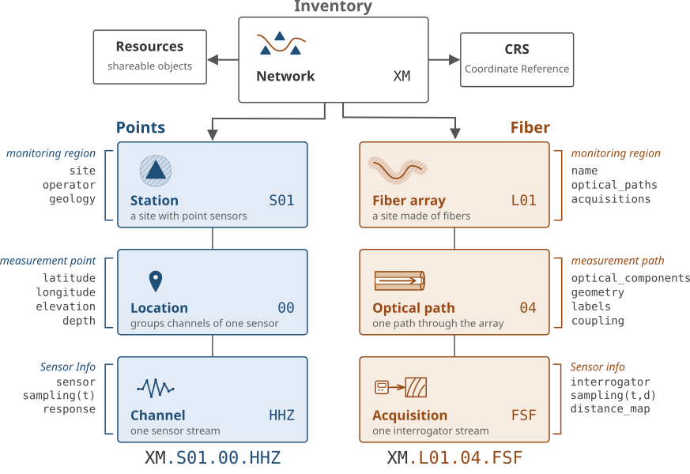
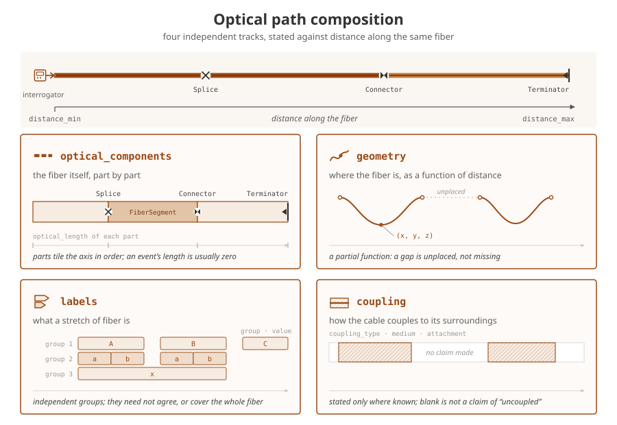

A DASDAE **inventory** describes the observing system behind a fiber archive: the optical path, interrogator settings, deployment geometry, coupling, and labels. It plays the role StationXML plays for point sensors while leaving the data files unchanged.

Patches join to the inventory through `acquisition_key` (`network.fiber_array.location.acquisition`) and time. The result is metadata: patch attributes, coordinates along the fiber, and names available for selection and grouping.

# The model

{width="100%" style="background-color: white" fig-alt="Conceptual comparison of observing-system identifiers: point sensors progress from network and station through location to channel, while fiber systems progress from network and fiber array through optical path to acquisition; both share resources and a coordinate reference system."}

This is a conceptual comparison with StationXML, not a literal containment diagram. In DASCore, acquisitions and optical paths are sibling collections on a fiber array. There is no `Location` model: a [`Channel`](`dascore.core.inventory.Channel`) carries a `location_code`, and a station holds its channels directly.

An [`Inventory`](`dascore.core.inventory.Inventory`) contains [`Network`](`dascore.core.inventory.Network`) objects. A network may hold conventional stations and [`FiberArray`](`dascore.core.inventory.FiberArray`) objects. Each fiber array holds:

- [`Acquisition`](`dascore.core.inventory.Acquisition`) objects, which describe an interrogator stream and map instrument distance onto an optical path.
- [`OpticalPath`](`dascore.core.inventory.OpticalPath`) objects, which describe what the light travelled through.

Shared objects such as interrogators, cables, enclosures, and measurements live under `Inventory.resources`. Other objects refer to them by `resource_id`, avoiding duplicate metadata; model constructors also accept the object itself.

{width="100%" style="background-color: white" fig-alt="Four tracks share optical distance: contiguous optical components tile the complete fiber, geometry is a partially defined function, labels form independent interval groups, and coupling is stated only where known."}

An optical path has four independent tracks along optical distance:

- `optical_components`: fiber segments, splices, connectors, and terminators. These tile the complete path and define its extent.
- `geometry`: measured quantities along the fiber, including coordinates named by the inventory's coordinate reference system.
- `coupling`: how each interval of cable meets its surroundings.
- `labels`: interval names such as borehole, drift, or zone.

Geometry, coupling, and labels may cover only part of the path. Missing coverage means “not stated,” not that the fiber or channel is absent.

Acquisitions and optical paths may have time-bounded epochs. Resolving a patch therefore uses both its acquisition key and time: hardware or geometry can change without changing the durable fiber-array identity.

# Authoring an inventory

Inventories can be written as one YAML or JSON document, but a directory is easier to maintain: models use YAML or JSON, while long tracks use CSV.

```text
inventory/
├── inventory.yaml
├── resources/
│   └── interrogator-1.yaml
├── acquisitions/
│   └── DAS.R2D1..RAW.yaml
└── fiber_arrays/
    └── DAS.R2D1/
        ├── attrs.yaml
        └── path/
            ├── attrs.yaml
            ├── optical_components.csv
            ├── geometry.csv
            ├── coupling.csv
            └── labels.csv
```

Each object file declares its `object_type`. An acquisition filename gives its full identity, and its `distance_map` connects the interrogator's axis to optical distance:

```yaml
object_type: Acquisition
data_category: DAS
data_type: velocity
gauge_length: 10.0
interrogator: interrogator-1
distance_map:
  instrument_distance: [0.0, 299.0]
  distance: [100.0, 399.0]
```

Track files are ordinary tables. For example:

```csv
object_type,distance_min,distance_max,name
FiberSegment,0,100,lead-in
Splice,100,,wellhead splice
FiberSegment,100,500,trench cable
```

A point component leaves `distance_max` blank; a fiber segment states both bounds. Rows are ordered by distance when loaded, regardless of file order.

The main authoring rules are:

- File and directory names state identity. If the file repeats an identity field, the values must agree.
- `path` is the reserved optical-path directory. `attrs` and `inventory` are reserved file stems.
- Files outside reserved object slots are ignored unless they declare a recognized inventory object; files inside reserved slots must follow the conventions. Field notes and photographs may live elsewhere in the inventory tree.
- CSV columns beginning with `_` are also ignored. Use `description` for notes that should survive serialization.
- Quantities that interpolate belong in `geometry.csv`; interval values belong in `labels.csv`. Units may appear in geometry headers, for example `chainage (m)`.

A dated entity uses an `@time` suffix, such as `path@2025-01-01/`, to begin a new epoch. The directory loader validates identities, object types, references, track coverage, and epoch ranges when [`dc.inventory`](`dascore.core.inventory_loader.inventory`) reads it.

Position is ordinary geometry whose column names match the coordinate reference system, or the canonical aliases `x`, `y`, and `z`. Positional axes must be stated together and use the CRS units; a geometry segment may omit all of them and record another quantity such as chainage instead.

The [tunnel inventory recipe](../recipes/tunnel_inventory.qmd) builds a complete directory, including resources, geometry, repairs, and multiple optical paths.

# Track semantics

Tracks use three shapes:

| shape | tracks | coverage | overlap | value outside coverage |
|---|---|---|---|---|
| tiling | `optical_components` | complete | none | — |
| function | geometry columns, coupling, labels with values | partial | none | `""` or `NaN` |
| membership | labels without values | partial | allowed | `False` |

A label with an empty `value` states membership; a label with a value defines an interval coordinate. Literal `true` and `false` values are refused because an empty value already spells membership. One label group must consistently contain text, numbers, or membership. Numeric groups use `NaN` outside coverage and therefore project as floating-point coordinates.

Intervals are half-open, `[start, end)`, so adjacent rows can tile without overlap. Projection still includes the final channel at the end of a covered run.

Geometry columns, label groups, and typed tracks become coordinates. Label group names cannot use structural names, track names, or recognized coordinate labels; see `RESERVED_GROUP_NAMES` in `dascore.core.inventory`. Geometry columns may use coordinate labels—that is how a segment states an axis—but cannot share a name with a label group.

# Inspecting and visualizing

The examples below use an inventory and patch designed to resolve together:

```{python}
import tempfile
from pathlib import Path

import dascore as dc
from dascore.examples import inventory_patch_pair

patch, inventory = inventory_patch_pair()
```

[`Inventory.get_names`](`dascore.core.inventory.Inventory.get_names`) separates scalar attributes from per-channel coordinates:

```{python}
names = inventory.get_names()
assert "gauge_length" in names.attrs
assert {"zone", "noisy", "coupling"} <= set(names.coords)
```

The result lists what the inventory *can* contribute, not what every channel will receive. A partially covered path may list a coordinate whose value is blank for some channels.

`Inventory.viz.path` aligns acquisitions, components, coupling, labels, and geometry along optical distance:

```{python}
inventory.viz.path(show=True);
```

Use `tracks=` to select lanes and `columns=` to select geometry columns. [`Inventory.viz.map`](`dascore.viz.inventory.map_path`) plots geometry in space, while [`Inventory.viz.timeline`](`dascore.viz.inventory.timeline`) plots acquisition and path epochs through time.

# Using an inventory with a spool

[`Spool.attach_inventory`](`dascore.core.spool.Spool.attach_inventory`) stores an inventory reference without changing patches or loading data. It is the only way a spool gets an inventory; `enrich` and `conform_to_inventory` always use the attached one.

```{python}
spool = dc.spool(patch).attach_inventory(inventory)
assert "gauge_length" not in dict(spool[0].attrs)
```

Once attached, inventory coordinates can drive selection and expansion:

```{python}
northern = spool.select(zone="north")
zones = spool.expand_by("zone")
assert set(zones.get_contents()["zone"]) == {"north", "south"}
```

Selection trims channels; a patch with no matching channels drops out.

Attaching a replacement inventory clears enrichment configured from the old one, preventing stale instructions from being applied to new metadata.

## Enriching patches

[`Spool.enrich`](`dascore.core.spool.Spool.enrich`) copies resolved metadata as patches are loaded. Acquisition and interrogator facts become attributes; optical-path facts become per-channel coordinates.

```{python}
enriched = spool.enrich()[0]
assert enriched.attrs.gauge_length == 10.0
assert "zone" in enriched.coords.coord_map
assert set(enriched.get_array("coupling")) == {"trench", ""}
```

The acquisition's `distance_map` performs the projection. Compatible distance units are converted; incompatible axes raise. An unresolved patch is returned unchanged with a warning, so enrichment never silently removes data.

By default, scalar acquisition fields and `interrogator.*` fields become attributes, while geometry, coupling, and labels become coordinates. `data_type` and `data_units` are excluded because processing may have changed the data; `sample_rate` and `spatial_interval` are excluded because the patch coordinates already state them. They can still be requested explicitly.

If a patch attribute conflicts with the inventory, `conflict` chooses the result: `keep_first` (default) keeps the patch value, `keep_last` uses the inventory, `drop` removes both, and `raise` reports the contradiction.

```{python}
stale = patch.update_attrs(gauge_length=99.0)
assert stale.enrich(inventory).attrs.gauge_length == 99.0
assert stale.enrich(inventory, conflict="keep_last").attrs.gauge_length == 10.0
```

[`Patch.enrich`](`dascore.proc.inventory.enrich`) performs the same operation directly on one patch, but an unresolved patch raises instead of using the spool's `on_unresolved` policy.

## Conforming a spool

[`Spool.conform_to_inventory`](`dascore.core.spool.Spool.conform_to_inventory`) eagerly resolves every row, rejects or drops unresolved patches, and subdivides patches at optical-path changes. Unlike attachment and enrichment, it can change spool length.

```{python}
stranger = dc.get_example_patch("random_das", acquisition_key="XX.NOPE..RAW")
mixed = dc.spool([patch, stranger]).attach_inventory(inventory)

conformed = mixed.conform_to_inventory(on_unresolved="ignore")
assert len(conformed) == 1
assert conformed[0].attrs.acquisition_key == "DAS.R2D1..RAW"
```

Subdivision preserves every sample exactly once. Use `on_unresolved="warn"` or `"ignore"` when an inventory intentionally covers only part of an archive.

Conforming raises when one patch straddles an acquisition change, since a patch cannot carry two acquisition configurations. This is why attachment remains inert: conforming can remove, split, or reject data and must be requested explicitly.

# Inventory files beside data

A data directory may carry its inventory as `.inventory/`, `.inventory.yaml`, `.inventory.yml`, or `.inventory.json`. A spool opened on that directory attaches it automatically:

```{python}
data_path = Path(tempfile.mkdtemp()) / "archive"
data_path.mkdir()
patch.io.write(data_path / "patch.h5", "DASDAE")
inventory.io.to_yaml(data_path / ".inventory.yaml")

carrying = dc.spool(data_path).update()
assert carrying.enrich()[0].attrs.gauge_length == 10.0
```

Discovery happens when the spool opens, but parsing waits until an inventory-backed operation. Ordinary `len`, sorting, chunking, patch loading, and selection using only indexed names do not parse it; selection on an inventory coordinate does. The inventory is then cached. After editing it, call `attach_inventory()` with no argument to reread the directory's copy.

Two `.inventory` spellings in one directory are refused as ambiguous. The visible name `inventory.yaml` is not a companion file: in the authoring format it is the inventory envelope.

# Serializing

[`Inventory.io.to_yaml`](`dascore.core.inventory.inventory_to_yaml`) produces the single-file interchange form. [`dc.inventory`](`dascore.core.inventory_loader.inventory`) reads directory, YAML, JSON, model, or serialized text inputs.

```{python}
text = inventory.io.to_yaml()
assert dc.inventory(text) == inventory

json_path = data_path / "inventory.json"
json_path.write_text(inventory.model_dump_json())
assert dc.inventory(json_path) == inventory
```

Invalid documents consistently raise [`InvalidInventoryError`](`dascore.exceptions.InvalidInventoryError`).
