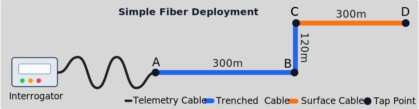

## Description

This recipe creates an inventory for a simple, yet realistic deployment. The interrogator is located some distance from the start of a trenched cable, connected via an E2000 coupler, then the trenched sensing cable goes for 300 m, turns north at 90 degrees, continues for 120 m, then exits the trench and turns towards the east for another 300 m @fig-simple-fiber-deployment.


{#fig-simple-fiber-deployment fig-cap="Simple Fiber Deployment."}

The tap test includes four descriptive points along the sensing fiber (@tbl-simple-tap-test). The coordinates are WGS84 latitude/longitude/elevation values centered in the gardens of Versailles.

| Point | Description | Optical Distance (m) | Latitude | Longitude | Elevation (m) |
|---|---|---:|---:|---:|---:|
| A | Start of sensing fiber after E2000 coupler | 50 | 48.807461 | 2.103905 | 115 |
| B | 90 degree bend in trenched section | 350 | 48.807461 | 2.108000 | 115 |
| C | Cable exits trench and becomes loose | 470 | 48.808539 | 2.108000 | 115 |
| D | End of loose surface-laid section | 770 | 48.808539 | 2.112095 | 115 |

: Tap-test points used to define the deployment geometry. {#tbl-simple-tap-test}

The deployment also uses two distinct fiber/cable types (@tbl-simple-fiber-types). The telemetry cable is only used to connect the interrogator to the E2000 coupler; sensing starts at point A.

| Cable | Role | Fiber Type | Construction | Notes |
|---|---|---|---|---|
| Telemetry lead-in | Interrogator to E2000 coupler | Single-mode | Armored patch cable | Not used for sensing |
| Nerve-Sensors Epsilon Sensor | DAS sensing fiber | Composite DFOS sensor | Epoxy composite with spiral reinforcement | Trenched from A-C, loose from C-D |

: Fiber and cable types used in the simple deployment. {#tbl-simple-fiber-types}

## Create Inventory

Creating the Inventory is best approached in multiple parts. 

### Create Tap Test DataFrame

First, we transcribe the tap test field notes into a data frame. This lets us use tabular field notes as the source for geometry and distance intervals.

```python
import pandas as pd

import dascore as dc
import dascore.core.inventory as inv

tap_test_df = pd.DataFrame(
    {
        "point": ["A", "B", "C", "D"],
        "description": [
            "Start of sensing fiber after E2000 coupler",
            "90 degree bend in trenched section",
            "Cable exits trench and becomes loose",
            "End of loose surface-laid section",
        ],
        "distance": [50.0, 350.0, 470.0, 770.0],
        "latitude": [48.807461, 48.807461, 48.808539, 48.808539],
        "longitude": [2.103905, 2.108000, 2.108000, 2.112095],
        "elevation": [115.0, 115.0, 115.0, 115.0],
    }
).set_index("point")

print(tap_test_df)

# Determine total physical length of the optical path.
total_optical_length = tap_points.loc["D", "distance"] - tap_points.loc["A", "distance"]

```

### Create Acquisition

The `Acquisition` describes the interrogator and its configuration.

```python
import dascore.core.inventory as inv

# The hardware details
interrogator = inv.Interrogator(
    manufacturer="Example Instruments",
    model="DAS-1000",
    serial_number="RUDAS88",
)

# The configuration of the interrogator
acquisition = inv.Acquisition(
    resource_id="simple_acquisition",
    code="RAW",
    location_code="",
    data_category="DAS",
    data_type="strain",
    data_units="strain",
    interrogator=interrogator,
    start_time="2026-06-01",
    acquisition_sample_rate=250.0,
    gauge_length=2.0,
    spatial_sampling_interval=1.0,
    extra_fields={"software_version": "v0.2.1"},
)
```

### Create Cable and Fiber Objects

These describe the cables/fibers used in the `FiberArray`. 

```python 
import dascore.core.inventory as inv

telemetry_cable = inv.Cable(
    name="Telemetry lead-in cable",
    owner="Example Operator",
    fiber_count=1,
    comment="Armored patch lead-in cable from interrogator.",
)

sensing_cable = inv.Cable(
    name="Nerve-Sensors Epsilon Sensor cable",
    owner="Example Operator",
    manufacturer="Nerve-Sensors SHM",
    model="Epsilon Sensor",
    specification=inv.ExternalResource(
        name="Nerve-Sensors Epsilon Sensor product page",
        uri="https://mono.ipros.com/en/product/detail/2000775912/",
    ),
    fiber_count=4,
)
```

### Create Optical Path from Scratch 

Here we create the optical path, the light travels in the cable. We start by creating it from scratch to demonstrate. 

#### Optical Components
We start with the optical components including fiber, connectors, etc.


```python
telemetry_lead = inv.FiberSegment(
    name="Telemetry lead-in fiber",
    optical_length=tap_points.loc["A", "distance"],
    fiber_standard="OS2",
    comment="Not used for sensing.",
    container=telemetry_cable,
)
coupler = inv.Connector(
    resource_id="simple_e2000_coupler",
    name="E2000 coupler",
    connector_type="E2000",
)
sensing_fiber = inv.FiberSegment(
    resource_id="simple_sensing_fiber",
    name="Epsilon sensing fiber",
    optical_length=tap_points.loc["D", "distance"] - tap_points.loc["A", "distance"],
    fiber_type="composite_dfos_sensor",
    fiber_standard="Nerve-Sensors Epsilon Sensor",
    buffer_type="epoxy_composite",
    container=sensing_cable,
)
```

#### Optical Geometry
Next, we define the geometries. These map real-world geometries (eg lat/lon) to optical distance. In this case they are linear segments. A geometry with only `optical_length` is also valid and represents a path interval whose location is unknown.

```python

geo_telemetry = inv.Geometry(optical_length=30)

geo_1 = inv.Geometry(
    name="simple_sensing_geometry_1",
    optical_length=300.0,
    geometry_type="linear",
    coordinates=(
        tap_points.loc["A", "coordinates"],
        tap_points.loc["B", "coordinates"],
    ),
)
geo_2 = inv.Geometry(
    name="simple_sensing_geometry_2",
    optical_length=120.0,
    geometry_type="linear",
    coordinates=(
        tap_points.loc["B", "coordinates"],
        tap_points.loc["C", "coordinates"],
    ),
)
geo_3 = inv.Geometry(
    name="simple_sensing_geometry_3",
    optical_length=300.0,
    geometry_type="linear",
    coordinates=(
        tap_points.loc["C", "coordinates"],
        tap_points.loc["D", "coordinates"],
    ),
)
```

#### Coupling Conditions
Coupling conditions follow the same pattern: an interval can be fully described, or it can carry only `optical_length` when the coupling context is unknown.

```python

telemetry_coupling = inv.CouplingCondition(
    optical_length=30,
)

trenched = inv.CouplingCondition(
    optical_length=420.0,
    coupling_type="trenched",
    deployment_type="trench",
    quality="good",
)
loose = inv.CouplingCondition(
    optical_length=300.0,
    coupling_type="loose",
    deployment_type="surface",
    quality="poor",
)
```

#### Annotations

Annotations provide a way of attaching some useful label to parts of the optical path. These can be used, eg, for select a subset of channels from a patch. 

:::{.note}
Overlapping labels are possible.
:::

```python

trenched_annotation = inv.OpticalPathAnnotation(
    distance=(50.0, 470.0),
    label="trenched",
)
loose_annotation = inv.OpticalPathAnnotation(
    distance=(470.0, 770.0),
    label="loose",
)
```

#### Create optical path

Now we create the entire optical path, with captures the meaningful physical aspects of the system.

```python
optical_length = tap_points.loc["D", "distance"] - tap_points.loc["A", "distance"]

optical_path = inv.OpticalPath(
    name="Simple DAS experiment",
    start_time="2026-06-01",
    optical_length=total_optical_length,
    optical_components=(
        telemtry_lead, coupler, sensing_fiber,
    ),
    geometries=(
        telemtry_geo, geo_1, geo_2, geo_3
    ),
    coupling_conditions=(
        trenched, loose
    ),
    annotations=(trenched_annotation, loose_annotation),
).validate()
```

### Combine Into Inventory

The `FiberArray` links the acquisition and optical path into one patch-resolvable observing identity.

```python
fiber_array = inv.FiberArray(
    code="SIMP",  # equiv to station code
    name="Simple trench array",
    start_time="2026-06-01",
    acquisitions=(acquisition,),
    optical_paths=(optical_path,),
    dims="distance,time",
    tag="simple",
)

network = inv.Network(
    code="XX",
    name="Simple example network",
    fiber_arrays=(fiber_array,),
)

inventory = inv.Inventory(
    records=(network,),
)

print(inventory)
```

## Inspect Stored Records


## Use The Inventory With A Patch

Patch methods resolve inventory metadata from `patch.attrs.data_source_id`, a dot-delimited `network.fiber_array.location.acquisition` string.

```python
patch = dc.get_example_patch("random_das").update_attrs(
    data_source_id="XX.SIMP..RAW",
)
patch = patch.update_coords(time_min="2026-06-01")

patch = patch.add_inventory_attrs(
    inventory,
    attrs=("tag", "acquisition_sample_rate", "interrogator.model"),
)
patch = patch.add_inventory_coords(
    inventory,
    coords=("label", "coupling_type", "latitude", "longitude", "elevation"),
    on_boundary="ignore",
)

print(patch.attrs.tag)
print(patch.attrs.acquisition_sample_rate)
print(patch.attrs.interrogator_model)
print(patch.get_array("label")[:5])
print(patch.get_array("coupling_type")[:5])
print(patch.get_array("latitude")[:5])
```
