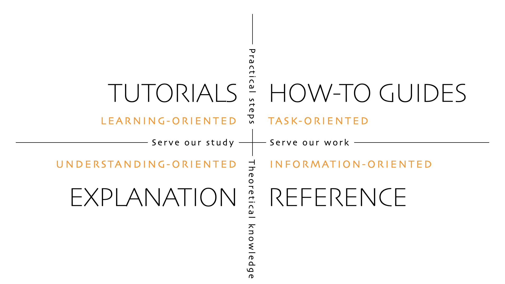

DASCore's documentation follows the [Diátaxis](https://diataxis.fr/) approach. In this system, developed by Daniele Procida, there are four types of documentation with different goals:

The sections of DASCore's documentation can be classified as follows:

**Tutorials**: Tutorial

**How-to guides**: Recipes, Contributing

**Explanation**: Notes

**Reference**: API

We should avoid mixing these types of documentation and instead provide links in relevant locations. A few implications:

* Long explanations of theory do not belong in the tutorial section; link to a page in the notes section when a longer explanation is needed.

* Tutorial pages should only show basic usage of functions/methods/classes, then [cross reference](../contributing/documentation.qmd#cross-references) the API page.

* Notes should focus on explanation and design reasoning rather than step-by-step instruction.
